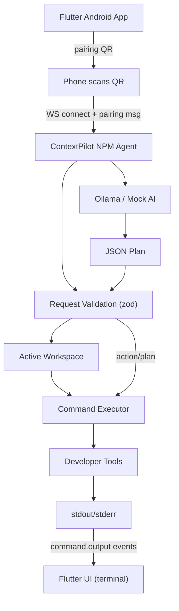

# ContextPilot — Architecture

> This document describes the **actual current architecture** as implemented in the repository. Source code is the source of truth.

## System Overview

ContextPilot is a local, phone-first developer agent. A Flutter Android app pairs with a Node.js/TypeScript "laptop agent" over a local network using WebSocket. The agent runs inside a project directory, detects the workspace, validates requests, maps allowlisted action IDs to typed command templates, executes them, and streams stdout/stderr back to the phone. Pairing uses a short-lived, single-use token delivered via QR code. Risky operations require explicit approval. Local AI (Ollama) planning is optional with a Mock fallback.

## Components

1. **Flutter mobile app** (`apps/mobile`) — control surface and UI.
2. **NPM / laptop agent** (`packages/agent`) — owns the workspace and executes commands.
3. **Local network** — the transport between phone and agent.
4. **Local AI** (optional) — Ollama, with a Mock adapter fallback.

## Flutter Application

- Riverpod state management; a single `WebSocketProtocolClient` connects to `ws://<host>:<port>`.
- Screens: Splash -> Onboarding -> Connect (QR or manual) -> main 5-tab shell (Home, Ask, Activity, Project, Settings).
- `connect_screen` builds a `ConnectionInfo` from the scanned QR payload (`qr_parser.dart`) or manual entry.
- `chat_provider.sendMessage` sends `user_request`; `sendCommand` sends `action_request`; `operation_provider` handles `approval_response` and `cancel_request`.
- Live terminal UI renders `command.output` chunks with stdout/stderr coloring.
- Android permissions: `CAMERA`, `INTERNET`.

## NPM Agent

- Express HTTP + `ws` server (same port). Entry: `bin/contextpilot.js` -> CLI (`start`/`doctor`/`mock-client`).
- HTTP endpoints: `/api/health`, `/api/project`, `/api/pair`, `/api/commands`.
- WebSocket dispatches by `type`: `pairing`, `user_request`, `action_request`, `approval_response`, `cancel_request`, `command.cancel`.
- `WorkspaceManager` uses `process.cwd()` as the workspace; `PermissionEngine` classifies risk; `CommandRegistry` holds the 28-action allowlist; `Executor` spawns and streams.

## Network Communication

- WebSocket at the server root; each frame is a JSON `ProtocolMessage { protocolVersion, messageId, type, timestamp, sessionId?, operationId?, payload }`.
- Server-to-phone events: `plan_created`, `tool_started/completed`, `operation_*`, `approval_required`, and streaming `command.start/output/completed/error/cancelled`.

## Pairing

- Agent prints a QR with `{ protocolVersion, agentId, host, port, pairingToken, projectName, projectId, expiresAt }`.
- Phone parses it and sends a `pairing` message. Token is 8-byte hex, TTL default 300s, single-use, constant-time compared. A successful pair creates one active session; all other messages require its `sessionId`.

## Request Validation

- zod schemas validate every inbound payload (`PairingRequestSchema`, `UserRequestSchema`, `ActionRequestSchema`, `ApprovalResponseSchema`, `CancelRequestSchema`).
- Session authentication is enforced for all non-pairing messages.

## Workspace Management

- `WorkspaceManager` resolves `process.cwd()`, `detectProject()` infers language/framework, `resolvePath()` enforces a path sandbox, and all commands run with `cwd = getWorkspaceRoot()`.

## Action Mapping

- `getCommandDefinition(action)` -> `CommandDefinition { action, group, executable, build(args), risk, longRunning? }`.
- The `build(args)` function always derives the shell string from a template; the phone/LLM never supplies a raw shell command.

## Command Execution

- `runCommandTemplate` (in `commands/executor.ts`) validates the allowlist/blocklist, checks the executable, then spawns the child with `cwd = workspace root`. On Windows, `.cmd` shims are routed via `%ComSpec% /d /s /c`. Default timeout 120 s.

## Output Streaming

- stdout/stderr are emitted per chunk as `command.output` events, captured into `result.stdout`/`result.stderr`, and surfaced in the Flutter live terminal.

## Security

- Allowlist of actions, zod validation, session auth, path sandbox, risk engine (SAFE/REVIEW/DANGEROUS/BLOCKED), special git-credential blocking, and no raw shell from phone/LLM. Legacy `run_command` is hidden from the AI.

## Local AI

- Ollama adapter queries `{baseUrl}/api/tags` and `POST /api/generate`; model default `qwen2.5-coder:1.5b`. `AIOrchestrator.planUserRequest()` returns a JSON plan (1-4 steps) filtered to available tools, falling back to `MockAIAdapter` when unavailable. Integrated in the agent, not in the Flutter app.

## Error Handling

- Errors are returned with a structured `error` message and code (`COMMAND_NOT_ALLOWED`, `INVALID_SESSION`, `PAIRING_TOKEN_EXPIRED`, `AI_UNAVAILABLE`, etc.). The phone maps these to user-friendly statuses (`protocolMismatch`, `pairingFailed`, `agentUnavailable`, and reconnect).

## Data Flow

```
Flutter app -> (WS) -> AgentServer.handleMessage -> zod validation + session check
  -> user_request -> AI planning -> Plan -> OperationManager steps
  -> action_request -> handleActionRequest -> PermissionEngine
  -> CommandRegistry -> Executor (workspace) -> stdout/stderr
  -> command.* events -> WS -> Flutter UI
```

## Repository Structure

```
ContextPilot/
├── apps/mobile/           # Flutter app
├── packages/agent/        # Node agent (src, tests, dist, bin)
├── docs/                  # PRD, TRD, UI-UX, AI-Memory, architecture
├── README.md, LICENSE, .gitignore
```

## Architectural Decisions

- Phone-first flow with the agent owning the filesystem.
- LAN-only, no cloud backend.
- Typed command templates instead of free-form shell.
- Allowlist + permissions + risk gating + approval.
- Streaming `command.*` events alongside legacy `operation_*`/`tool_*` for compatibility.
- Single active session, single-use pairing token.
- Optional Ollama behind an adapter with a Mock fallback.

## Current Limitations

- No multi-project switching (workspace = start dir).
- No session persistence / single active session.
- No TLS on WebSocket (`ws://`, LAN trust model).
- Long-running commands capped at 120 s.
- `AppConstants.defaultPort` (Flutter) `8080` vs agent default `8765` (only affects manual entry).

## Diagram (Mermaid)


